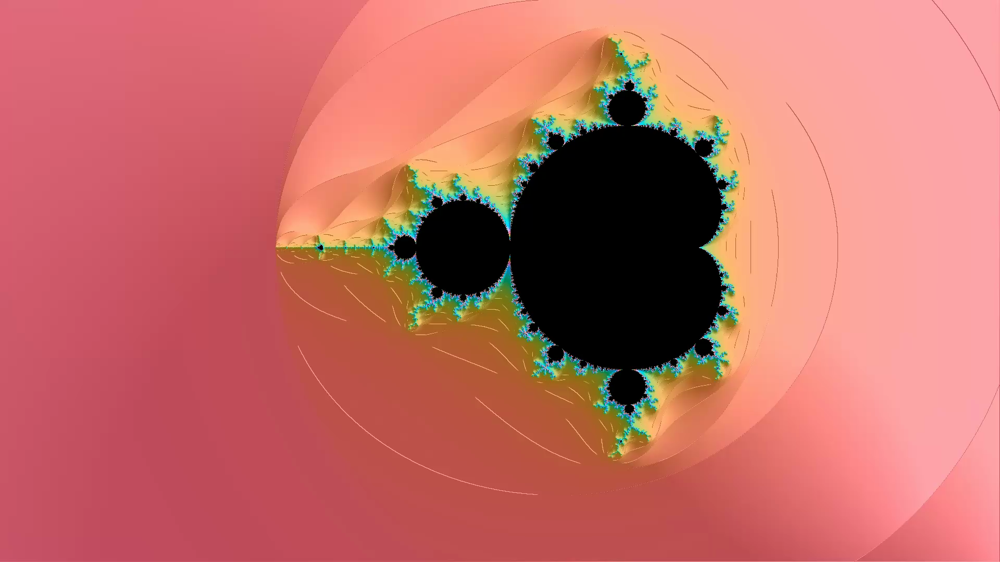
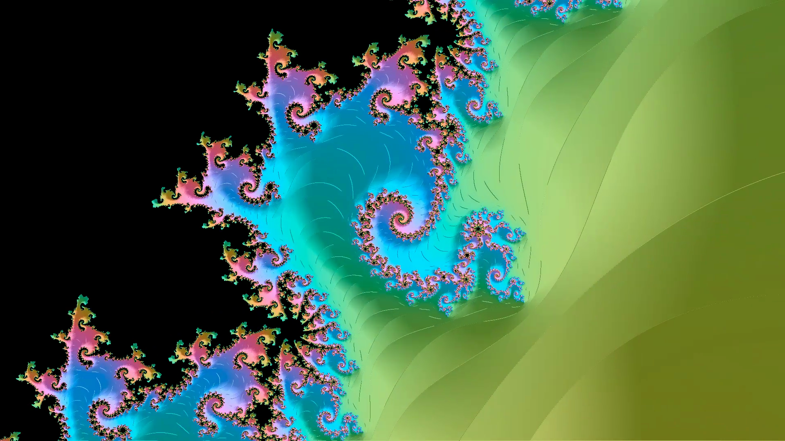
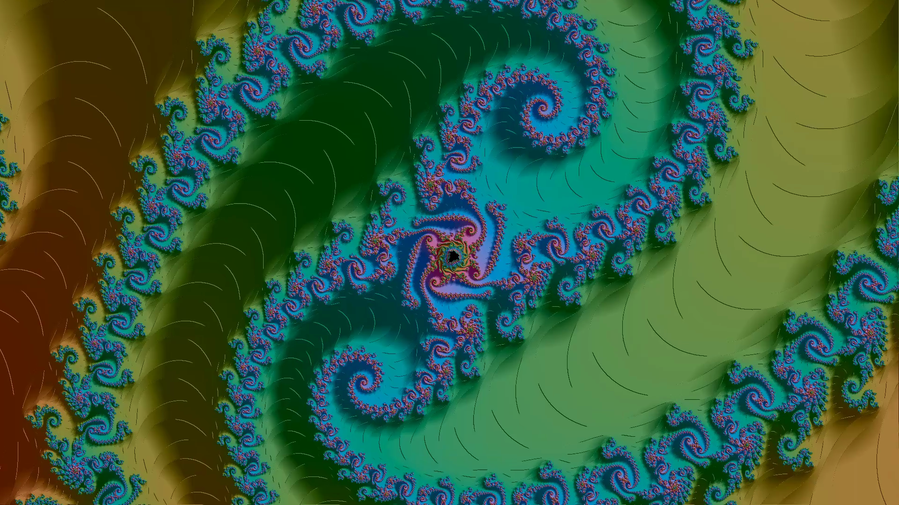
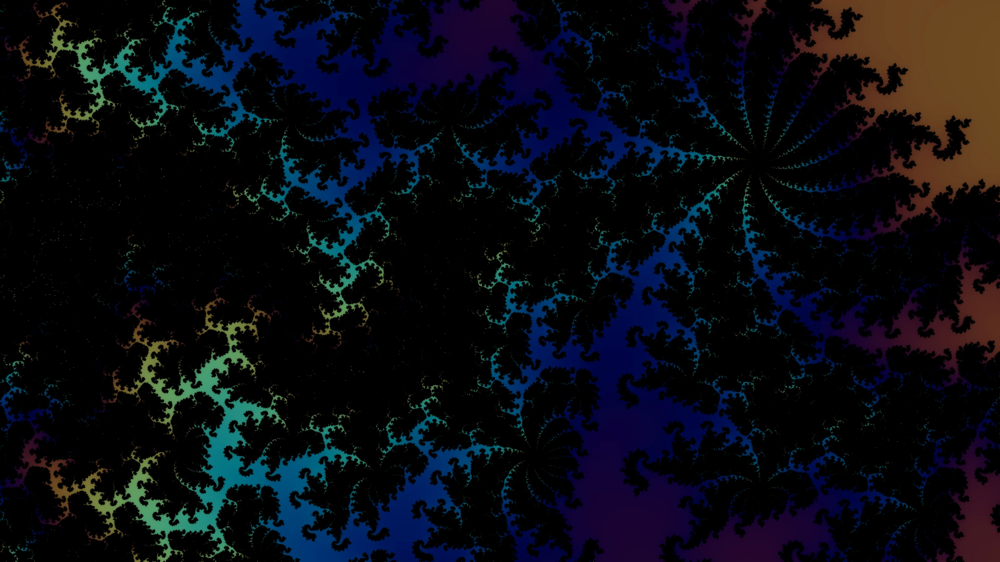
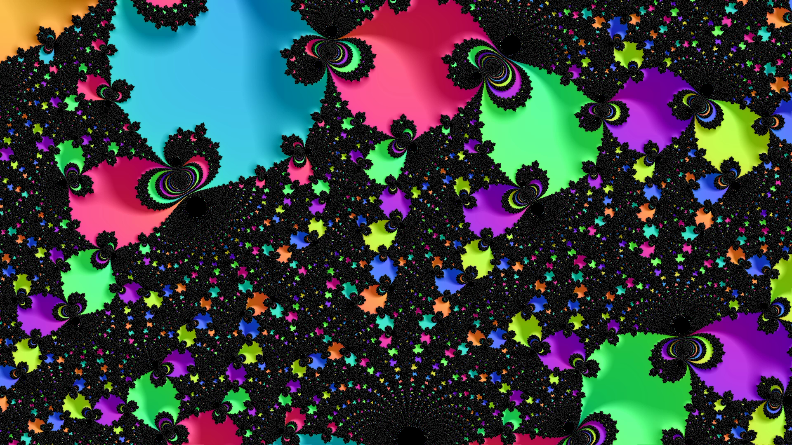
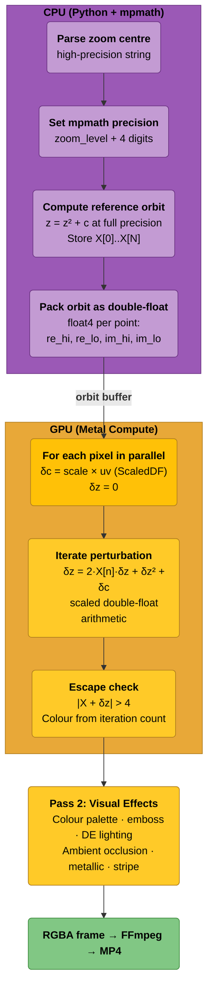

# Mandelmela -- Mandelbrot Fractal Renderer

**GPU-accelerated Mandelbrot deep-zoom video renderer for Apple Silicon, using perturbation theory for arbitrary-depth exploration (10^100+) and multi-float precision arithmetic for shallow zooms.**

<p align="center">
  
</p>

<p align="center">
  
  
</p>

<p align="center">
  
  
</p>

**Demo video:** [Emboss zoom (84 MB)](assets/demo_emboss.mp4) — copper palette, 0.9 emboss, metallic shading, 1080p.

https://github.com/spolspol/mandelmela/raw/main/assets/demo_emboss.mp4

### Showcase Render Commands

Each command below produces a short, visually striking demo. Render time is roughly 1–5 minutes on Apple Silicon at 720p.

**Copper emboss with metallic shading** (the hero render):
```bash
python mandelbrot_perturb.py -d 0.25 -m 1e30 -l seahorse -r 1080p \
  -e 0.9 --palette copper --metallic 0.5 --ao 1.5 --emboss-angle 135
```

**DE lighting with aurora palette** (3D surface effect):
```bash
python mandelbrot_perturb.py -d 0.25 -m 1e20 -l dragon -r 1080p \
  --de-lighting --palette aurora --ao 2.0 --stripe 0.5
```

**Extreme deep zoom with fire palette** (perturbation theory showcase):
```bash
python mandelbrot_perturb.py -d 1 -m 1e100 -l seahorse -r 720p \
  --palette fire -e 0.5 --stripe 0.3 --detail-boost 0.4
```

**Neon high-chroma spiral** (vivid colour showcase):
```bash
python mandelbrot_perturb.py -d 0.25 -m 1e15 -l spiral -r 1080p \
  --palette neon --ao 1.0 -e 0.3
```

**Lava tentacle with full effects** (maximum visual complexity):
```bash
python mandelbrot_perturb.py -d 0.25 -m 1e25 -l tentacle -r 1080p \
  --palette lava -e 0.7 --metallic 0.4 --ao 2.5 --stripe 0.6 --stripe-freq 5.0 \
  --detail-boost 0.5 --emboss-angle 100
```

**Midnight deep spike** (dark moody atmosphere):
```bash
python mandelbrot_perturb.py -d 0.5 -m 1e40 -l deepspike -r 1080p \
  --palette midnight --de-lighting --ao 3.0 --metallic 0.3
```

---

## What Is the Mandelbrot Set?

The Mandelbrot set is one of the most famous objects in mathematics. It is defined by a deceptively simple rule: for each point *c* in the complex plane, iterate the function

```
z(n+1) = z(n)^2 + c,   starting from z(0) = 0
```

If the sequence remains bounded (|z| never exceeds 2), the point *c* belongs to the Mandelbrot set. If it escapes, the *speed* of escape determines the colour.

The boundary of the set is infinitely complex -- no matter how deeply you zoom, new detail always appears. This self-similar yet never-repeating structure makes it one of the most visually rich objects in all of mathematics, and exploring it demands extraordinary numerical precision.

---

## The Deep-Zoom Precision Problem

Standard GPU floating-point (IEEE 754 `float32`) provides roughly 7 decimal digits of precision. That is enough to zoom in by a factor of about 10^6 before the image dissolves into blocky artefacts. Even 64-bit `float64` (which Apple Silicon GPUs do not natively support) only extends the limit to around 10^15.

To produce smooth, artefact-free images at zoom depths of 10^36, 10^73, or beyond, the renderer implements two complementary strategies:

1. **Multi-float precision arithmetic** -- extending GPU precision by chaining multiple `float32` values together.
2. **Perturbation theory** -- computing one reference orbit at arbitrary precision on the CPU, then using cheap GPU deltas for every pixel.

---

## Multi-Float Precision Arithmetic

The renderer represents high-precision numbers as the unevaluated sum of *N* non-overlapping `float32` components:

```
value = x[0] + x[1] + x[2] + ... + x[N-1]
```

where each component captures roughly 7 additional decimal digits of precision. This is a generalisation of the well-known *double-float* (or *double-double*) technique to arbitrary width.

All arithmetic operations -- addition, multiplication, negation -- are implemented using error-free transformations (Knuth's two-sum, Dekker splitting, two-product) followed by a single-sweep renormalisation pass to maintain non-overlapping invariants.

| Components | Name         | Effective digits | Max zoom depth           |
|:----------:|:-------------|:----------------:|:-------------------------|
| 1          | float32      |  ~7              | ~10^3                    |
| 2          | double-float | ~14              | ~10^8                    |
| 3          | triple-float | ~21              | ~10^13                   |
| 4          | quad-float   | ~28              | ~10^19                   |

The precision level is selected automatically based on the current zoom depth and output resolution. Metal function constants enable compile-time specialisation, so each precision level compiles to a dedicated GPU kernel with zero runtime branching overhead.

Beyond PREC 4, the renderer transitions to perturbation theory for unlimited depth.

---

## Features

- **Perturbation theory rendering** -- arbitrary-depth zoom video rendering (10^100 and beyond) using CPU reference orbits and GPU scaled-delta iteration
- **Hybrid direct + perturbation mode** -- automatic direct multi-float computation (PREC 1–4) at shallow depths, transitioning to perturbation theory at deeper zooms
- **Adaptive precision** -- automatic precision level selection based on zoom depth and output resolution
- **Two-pass rendering architecture** -- pass 1 computes fractal iteration data; pass 2 applies all visual effects using screen-space derivatives
- **Visual effects** -- 17 colour palettes, LCH perceptual colour space, distance estimation lighting, emboss, metallic reflections, stripe average, ambient occlusion
- **Boundary seeking** -- optional XaoS-style automatic navigation toward visually interesting boundary regions
- **Resolution-aware thresholds** -- precision transitions optimised per resolution (720p through 8K) to maximise performance
- **Multiple zoom locations** -- 25+ pre-defined deep-zoom coordinates with up to 48-digit precision

---

## Requirements

- **macOS** with Apple Silicon (M1 or later)
- **Python 3.10+**
- **ffmpeg** (for video encoding): `brew install ffmpeg`

Python packages (see `requirements.txt`):

| Package                    | Purpose                               |
|:---------------------------|:--------------------------------------|
| `pygame_ce`                | Live preview window                   |
| `numpy`                    | Vectorised array operations           |
| `pyobjc-framework-Metal`   | Metal GPU compute                     |
| `mpmath`                   | Arbitrary-precision arithmetic (perturbation theory) |

---

## Installation

```bash
git clone https://github.com/spolspol/mandelmela.git
cd mandelmela
pip install -r requirements.txt
brew install ffmpeg
```

---

## Quick Start

```bash
# Render a 5-minute 4K zoom video using perturbation theory (10^100 magnification)
python mandelbrot_perturb.py -d 5 -m 1e100 -l seahorse -r 4k
# Quick test with preview window
python mandelbrot_perturb.py -d 0.1 -m 1e8 -p -l seahorse -r 360p
# Emboss lighting with copper palette and metallic shading
python mandelbrot_perturb.py -d 5 -m 1e50 -l dragon -r 1080p -e 0.8 --palette copper --metallic 0.3```

---

## Architecture

For zoom depths beyond the reach of direct multi-float arithmetic (approximately 10^14 and deeper), the renderer switches to **perturbation theory**. This approach computes a single reference orbit at arbitrary precision on the CPU, then iterates only the tiny delta between each pixel and the reference point on the GPU.

At shallow zoom depths (up to ~10^14), the renderer uses **direct multi-float computation** (PREC 1 through PREC 4) for maximum speed, and automatically transitions to perturbation theory when the zoom exceeds the direct precision limit.



### Scaled Delta Representation

Standard `float32` has a dynamic range of roughly 10^-38 to 10^+38. At zoom 10^100, the pixel-to-pixel delta is on the order of 10^-100, which would underflow to zero immediately.

The `ScaledDF` struct solves this by separating mantissa from exponent:

```metal
struct ScaledDF {
    float2 mantissa;  // double-float (hi, lo), normalised to ~[0.5, 2.0)
    int exponent;     // power-of-2 exponent (any int32 value)
};
```

All delta arithmetic (add, subtract, multiply) operates on the mantissa using error-free double-float routines, while exponents are managed separately. After each operation, the result is renormalised to keep the mantissa in a representable range. This extends the effective dynamic range to 10^(+-2^31), far exceeding any practical zoom depth.

---

## CLI Arguments

### Core parameters

| Flag | Long form | Default | Description |
|:-----|:----------|:--------|:------------|
| `-d` | `--duration` | `5` | Video duration in minutes |
| `-m` | `--magnification` | `1e12` | Final zoom magnification |
| `-o` | `--output` | auto | Output filename |
| `-s` | `--iter-steepness` | `2.0` | Iteration curve power (1=linear, 2=late ramp) |
| `-p` | `--preview` | off | Show live preview window |
| `-l` | `--location` | `seahorse` | Zoom location preset |
| `-r` | `--resolution` | `4k` | Resolution: 720p, 1080p, 2k, 1440p, 4k, 8k, or WxH |
| `-e` | `--emboss` | `0.0` | Emboss strength (0--1) |

### Iteration control

| Flag | Long form | Default | Description |
|:-----|:----------|:--------|:------------|
| | `--max-iter` | auto | Maximum iterations (0=auto based on magnification) |
| | `--colour-freq` | `0.025` | Base colour band frequency |
| | `--colour-count` | `3` | Number of colour cycles |
| | `--base-iter` | `100` | Minimum iteration count |
| | `--iter-formula` | `log` | Iteration formula: `log` or `power` |

### Colour and palette

| Flag | Long form | Default | Description |
|:-----|:----------|:--------|:------------|
| | `--palette` | `classic` | Preset: classic, fire, ice, neon, earth, monochrome, ocean, sunset, toxic, candy, copper, aurora, lava, pastel, midnight, autumn, electric |
| | `--palette-base` | preset | Custom base RGB, e.g. `"0.5,0.3,0.1"` |
| | `--palette-amp` | preset | Custom amplitude RGB |
| | `--palette-phase` | preset | Custom phase RGB |
| | `--colour-space` | `lch` | Colour space: `rgb` or `lch` |
| | `--lch-lightness` | `65.0` | LCH base lightness (0--100) |
| | `--lch-chroma` | `50.0` | LCH base chroma (0--130) |

### Lighting and effects

| Flag | Long form | Default | Description |
|:-----|:----------|:--------|:------------|
| | `--de-lighting` | off | Enable distance estimation lighting |
| | `--light-angle` | `-0.5,0.5` | Light direction as `"x,y"` |
| | `--ao` | `0.0` | Ambient occlusion strength (0--5) |
| | `--stripe` | `0.0` | Stripe average intensity (0--1) |
| | `--stripe-freq` | `3.0` | Stripe frequency |
| | `--metallic` | `0.0` | Metallic surface strength (0--1) |
| | `--detail-boost` | `0.0` | Boost fine detail brightness (0--1) |
| | `--emboss-angle` | `135.0` | Emboss light angle in degrees |

### Precision and mode

| Flag | Long form | Default | Description |
|:-----|:----------|:--------|:------------|
| | `--precision` | auto | Reference orbit precision in decimal digits (0=auto) |
| | `--no-direct` | off | Disable direct mode, force perturbation at all depths |
| `-q` | `--quality` | `85` | Video encoding quality (0--100) |

### Boundary seeking

| Flag | Long form | Default | Description |
|:-----|:----------|:--------|:------------|
| | `--boundary-seek` | off | Enable automatic boundary seeking |
| | `--seek-interval` | auto | Frames between boundary searches |
| | `--seek-grid` | `32` | Grid size for boundary sampling (NxN) |
| | `--seek-smoothing` | `15` | Frames to smooth centre transitions |

### Transform

| Flag | Long form | Default | Description |
|:-----|:----------|:--------|:------------|
| | `--start-angle` | `0.0` | Initial rotation angle in degrees |
| | `--rotation-speed` | `0.003` | Rotation speed (radians/frame, 0=disable) |

---

## Technical Reference

### Precision System Architecture

The renderer uses a **pipeline factory** pattern to create specialised GPU kernels for each precision level. At shader compile time, a `constant int PREC [[function_constant(0)]]` value is injected, and the Metal compiler eliminates all code paths for other precision levels through dead-code elimination.

The result is four distinct kernel types for direct mode:

| Pipeline | PREC value | Arithmetic | Key optimisations |
|:---------|:----------:|:-----------|:------------------|
| Pure float32 | 1 | Scalar `float` | No multi-float overhead, direct `ldexp` scale reconstruction |
| Double-float | 2 | `float2` (hi, lo) | Dedicated `df_add`/`df_mul` with no loops, no renorm sweep |
| Triple-float | 3 | `float[3]` via generic path | Unrolled tf_add/tf_mul with 2-pass renormalisation |
| Quad-float | 4 | `float[4]` via generic path | Same generic path, 4-component convolution multiply |

A fifth pipeline handles perturbation mode, using the `ScaledDF` representation for delta arithmetic.

### Precision Does Not Equal Dynamic Range

A common misconception is that increasing arithmetic precision also increases the representable number range. In reality, precision and dynamic range are orthogonal:

- **Precision** (significant digits) determines how many digits of a number are meaningful. Multi-float arithmetic extends this from 7 to 28 digits.
- **Dynamic range** (exponent range) determines the smallest and largest representable values. A `float32` can represent numbers from ~10^-38 to ~10^+38 regardless of precision.

At zoom 10^100, the *coordinates* of the zoom centre need ~104 digits of precision (handled by mpmath). But the *pixel-to-pixel delta* is on the order of 10^-100, which is far below `float32`'s minimum representable value. This is why the perturbation renderer uses the ScaledDF representation: it separates the mantissa (which needs only ~14 digits of precision) from the exponent (which needs large dynamic range).

### Resolution-Aware Precision Profiles

The minimum precision required at a given zoom depth depends on the output resolution, because wider images need to distinguish more pixels across the viewport. The formula is:

```
required_digits = zoom_level + log10(width / 3)
```

Where `zoom_level` is log10 of the magnification and `width` is the frame width in pixels. The `log10(width / 3)` term represents the additional digits needed to resolve individual pixels.

**Direct mode precision thresholds (4K baseline):**

| PREC | Effective digits | Max zoom (4K) | Max zoom (720p) | Max zoom (8K) |
|:----:|:----------------:|:-------------:|:---------------:|:-------------:|
| 1    | ~7               | 10^3          | 10^3.5          | 10^2.7        |
| 2    | ~14              | 10^8          | 10^8.5          | 10^7.7        |
| 3    | ~21              | 10^13         | 10^13.5         | 10^12.7       |
| 4    | ~28              | 10^19         | 10^19.5         | 10^18.7       |

**Direct-to-perturbation transition:**

| Resolution | Transition zoom |
|:-----------|:----------------|
| 360p       | 10^14.5         |
| 720p       | 10^14           |
| 1080p      | 10^13.8         |
| 4K         | 10^13.2         |
| 8K         | 10^12.9         |

### Zoom Locations

25+ pre-defined locations with coordinates stored as high-precision strings (up to 48 digits):

`classic`, `seahorse`, `elephant`, `spiral`, `julia`, `dragon`, `star`, `corona`, `deepspike`, `tentacle`, `needle`, `vortex`, `flare`, `plume`, `filament`, `ember`, `prism`, `abyss`, `iris`, `zenith`, `crest`, `fragment`, `center`, `junction`, and more.

---

## Performance Notes

Rendering performance depends primarily on four factors:

1. **Precision level** -- higher precision means more ALU operations per iteration. PREC=1 (pure float32) is roughly 10x faster than PREC=4 (quad-float).
2. **Iteration count** -- deeper zooms require more iterations per pixel. Iteration count scales logarithmically with zoom depth (default formula: `400 * ln(magnification)`).
3. **Resolution** -- pixel count scales quadratically. 4K has 4x the pixels of 1080p.
4. **Visual effects** -- distance estimation lighting and stripe average each add measurable overhead to the per-iteration inner loop.

Typical performance on Apple M-series hardware (M1/M2/M3/M4):

- **Shallow zoom** (PREC=1, 1000 iterations, 4K): several hundred frames per second
- **Medium zoom** (PREC=2, 3000 iterations, 4K): tens of frames per second
- **Deep zoom** (PREC=4, 10,000 iterations, 4K): a few frames per second
- **Extreme zoom with perturbation**: depends heavily on reference orbit computation time; GPU iteration is typically faster than the direct path at equivalent depth because it operates on `float2` deltas rather than `float[N]` arrays.

---

## Future Directions

- **Series approximation** -- skip early iterations by approximating the polynomial orbit near the reference point, reducing GPU work by 10--100x for deep zooms.
- **Glitch detection and rebasing** -- detect pixels where the delta grows too large relative to the reference orbit, and automatically rebase to a new reference point.
- **Delta-squared elision** -- at extreme depths, the dz^2 term in the perturbation recurrence becomes negligible compared to 2*X*dz, enabling a simplified (and faster) iteration step.
- **Orbit caching** -- reuse reference orbits across consecutive frames when the zoom centre does not change, avoiding redundant CPU computation.

---

## References

- K. I. Martin, *Superfractalthing -- Perturbation Theory*, 2013.
  Foundational paper on perturbation theory for Mandelbrot rendering.
- K. I. Martin, *Superfractalthing Maths*, 2013.
  Detailed mathematical treatment of the perturbation approach.
- C. Stoll, *The Mandelbrot Set in Multi-Precision*, blog post.
  Practical multi-precision GPU implementation notes.
- T. J. Dekker, *A Floating-Point Technique for Extending the Available Precision*, Numerische Mathematik 18, 224--242, 1971.
  Original double-float error-free splitting algorithm.
- Y. Hida, X. S. Li, and D. H. Bailey, *QD: A Double-Double and Quad-Double Package*, 2000.
  Library and algorithms for extended-precision floating-point using double-double arithmetic.

---

## Licence

Copyright (C) 2026

This program is free software: you can redistribute it and/or modify it under the terms of the **GNU General Public License v3.0** as published by the Free Software Foundation.

See the [LICENCE](LICENSE) file or <https://www.gnu.org/licenses/gpl-3.0.html> for full terms.
